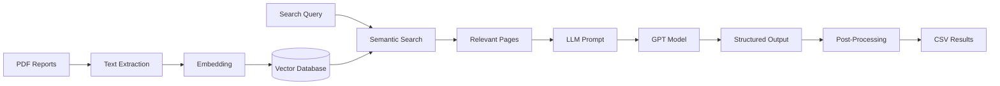
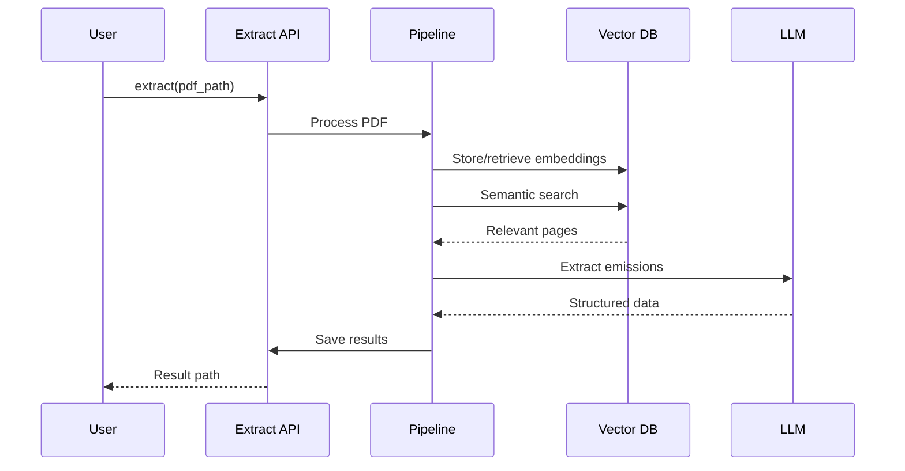

# Architecture

climatextract uses a Retrieval-Augmented Generation (RAG) architecture to extract emissions data from PDF reports. This page provides a high-level overview of how the components work together.

---

## Pipeline Overview

---

## Core Components

### 1. PDF Processing

The pipeline starts by extracting text from PDF pages:

- Uses `pdf2image` and OCR fallback for scanned documents
- Each page is processed independently
- Maintains page number metadata for traceability

### 2. Embedding & Storage

Text is converted to vector embeddings for semantic search:

- Default model: `text-embedding-ada-002` (OpenAI)
- Embeddings stored in DuckDB for efficient retrieval
- Query embeddings are cached to avoid redundant API calls

### 3. Semantic Search

When processing a document, the pipeline:

1. Embeds the search query (e.g., "CO₂ emissions Scope 1 2 3")
2. Computes cosine similarity against all page embeddings
3. Retrieves top-k most relevant pages

### 4. LLM Extraction

Relevant pages are passed to a large language model:

- Structured prompts define the extraction task
- Pydantic models parse and validate output
- Each scope-year combination is extracted independently

### 5. Post-Processing

Raw LLM output is cleaned and structured:

- Unit normalization (e.g., "tonnes" → "tCO2e")
- Duplicate resolution across pages
- Value standardization and validation

---

## Key Classes

| Class | Purpose |
|-------|---------|
| `ValueRetrieverPipeline` | Orchestrates the full extraction workflow |
| `EmbeddingsRepository` | Manages DuckDB storage for embeddings |
| `CustomPromptGaia` | Structures LLM prompts with Pydantic parsing |
| `EvaluatorPrecisionRecallF1` | Computes evaluation metrics |

---

## Data Flow

---

## Next Steps

- [RAG Pipeline](rag-pipeline.md) – Deep dive into retrieval and generation
- [Prompts](prompts.md) – How prompts are structured
- [Evaluation](evaluation.md) – Measuring extraction quality
