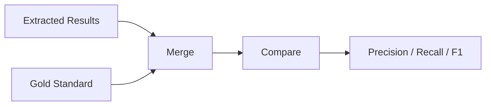

# Evaluation

climatextract includes a comprehensive evaluation framework to measure extraction quality against gold standard datasets. This page explains the evaluation metrics and process.

---

## Evaluation Workflow



---

## Gold Standard Dataset

The evaluation uses human-annotated ground truth data:

- **Format**: CSV with expected emissions values
- **Columns**: `report_name`, `year`, `scope`, `value`, `unit`
- **Default**: `data/evaluation_dataset/gist_2025.csv`

```toml
[evaluation]
gold_standard = "data/evaluation_dataset/gist_2025.csv"
```

---

## Evaluation Modes

### Default Mode

Standard evaluation with match classification:

```toml
[evaluation]
evaluation_mode = "default"
```

Produces:

- Comparison reports by document
- Match type classification (found/not found)
- Error analysis

### Precision-Recall-F1 Mode

Information retrieval metrics:

```toml
[evaluation]
evaluation_mode = "precision_recall_f1"
```

Produces:

- Overall precision, recall, F1
- Per-document metrics
- Error type breakdown

### Both Modes

Run both evaluations:

```toml
[evaluation]
evaluation_mode = "both"
```

---

## Metrics Explained

### Precision

How many extracted values were correct:

\[
\text{Precision} = \frac{\text{True Positives}}{\text{True Positives} + \text{False Positives}}
\]

High precision = Few incorrect extractions

### Recall

How many expected values were found:

\[
\text{Recall} = \frac{\text{True Positives}}{\text{True Positives} + \text{False Negatives}}
\]

High recall = Few missed values

### F1 Score

Harmonic mean of precision and recall:

\[
\text{F1} = 2 \times \frac{\text{Precision} \times \text{Recall}}{\text{Precision} + \text{Recall}}
\]

---

## Match Classification

Values are classified as:

| Type | Description |
|------|-------------|
| **True Positive** | Extracted value matches gold standard |
| **False Positive** | Extracted value not in gold standard |
| **False Negative** | Gold standard value not extracted |
| **True Negative** | No value for a specific scope/year extracted, also not given in gold standard |

Matching considers:

- Year and scope must match exactly
- Value must be within tolerance (default: exact match)
- Unit normalization is applied before comparison

---

## Running Evaluation

From Python:

```python
from climatextract import extract_and_evaluate

result_path = extract_and_evaluate(
    pdf_input="./data/pdfs/sample/",
    gold_standard_path="./data/evaluation_dataset/gist_2025.csv"
)
```

---

## Output Files

Evaluation creates additional files in the output directory:

| File | Contents |
|------|----------|
| `04a_results_available_in_report.csv` | Values where info exists in report |
| `04b_results_not_available_in_report.csv` | Values where info doesn't exist |
| `05_results_aggregated_by_*.csv` | Metrics aggregated by different dimensions |
| `error_analysis_per_doc.csv` | Per-document error analysis (precision_recall_f1 mode) |
| `error_analysis_per_row.csv` | Per-row error analysis (precision_recall_f1 mode) |

---

## MLflow Integration

When MLflow is enabled, metrics are logged for experiment tracking:

- Per-run precision, recall, F1
- Comparison with previous runs
- Hyperparameter tracking

```toml
[mlflow]
experiment_name = "/Shared/Experiments/precision_recall_analysis"
```

---

## Next Steps

- [API Reference](../api-reference/public-api.md) – Public API functions
- [Background](../research/background.md) – Academic context and motivation
