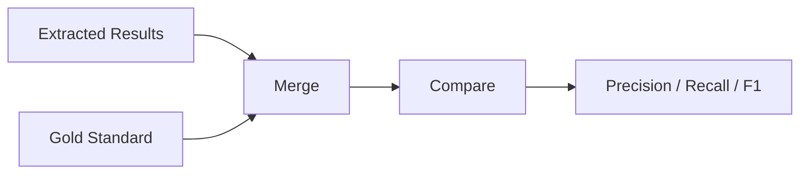

# Evaluation

climatextract includes a comprehensive evaluation framework to measure extraction quality against gold standard datasets. This feature is only tested with our own gold-standard dataset ([Paper](https://doi.org/10.1038/s41597-025-05664-8), [Data](https://zenodo.org/records/18696096)), not with other datasets.

This page explains the evaluation metrics and process.

---

## Evaluation Workflow



---

## Gold Standard Dataset

The evaluation uses human-annotated ground truth data:

- **Format**: CSV with expected emissions values
- **Columns**: `report_name`, `year`, `scope`, `value`, `unit`
- **Default**: `data/evaluation_dataset/gold_standard.csv`

```toml
[evaluation]
gold_standard = "data/evaluation_dataset/gold_standard.csv"
```

---

## Evaluation Output

Calling `extract_and_evaluate()` produces:

- Row-by-row comparison with benchmark
- Per-document metrics with error type
- Overall precision, recall, F1

---

## Metrics Explained

### Precision

How many extracted values were correct:

\[
\text{Precision} = \frac{\text{True Positives}}{\text{True Positives} + \text{False Positives}}
\]

High precision = Few incorrect extractions

### Recall

How many expected values were found:

\[
\text{Recall} = \frac{\text{True Positives}}{\text{True Positives} + \text{False Negatives}}
\]

High recall = Few missed values

### F1 Score

Harmonic mean of precision and recall:

\[
\text{F1} = 2 \times \frac{\text{Precision} \times \text{Recall}}{\text{Precision} + \text{Recall}}
\]

---

## Match Classification

Values are classified as:

| Type | Description |
|------|-------------|
| **True Positive** | Extracted value matches gold standard |
| **False Positive** | Extracted value not in gold standard |
| **False Negative** | Gold standard value not extracted |
| **True Negative** | No value for a specific scope/year extracted, also not given in gold standard |

Matching considers:

- Year and scope must match exactly
- Value must be within tolerance (default: exact match)
- Unit normalization is applied before comparison

---

## Running Evaluation

From Python:

```python
from climatextract import extract_and_evaluate

result_path = extract_and_evaluate(
    pdf_input="./data/pdfs/sample/",
    gold_standard_path="./data/evaluation_dataset/gold_standard.csv"
)
```

---

## Output Files

Evaluation creates additional files in the output directory:

| File | Contents |
|------|----------|
| `eval_results_vs_benchmark.csv` | Results matched row-wise with benchmark data |
| `eval_results_metrics_by_ReportName.csv` | Metrics aggregated per report |
| `config_and_metrics.json` | Configuration plus extraction and evaluation metrics |

---

## MLflow Integration

When MLflow is enabled, metrics are logged for experiment tracking:

- Per-run precision, recall, F1
- Comparison with previous runs
- Hyperparameter tracking

```toml
[mlflow]
experiment_name = "/Shared/Experiments/precision_recall_analysis"
```

---

## Next Steps

- [API Reference](../api-reference/public-api.md) – Public API functions
- [Background](../research/background.md) – Academic context and motivation
