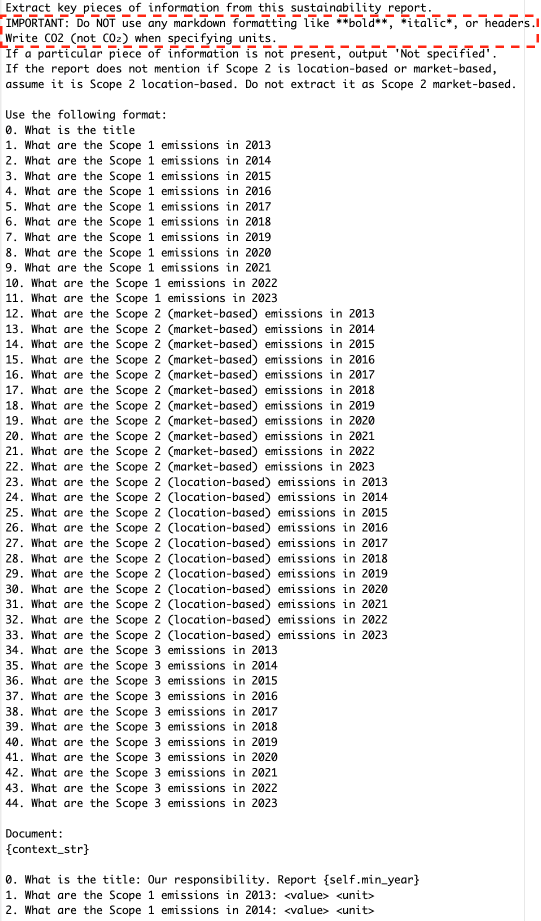
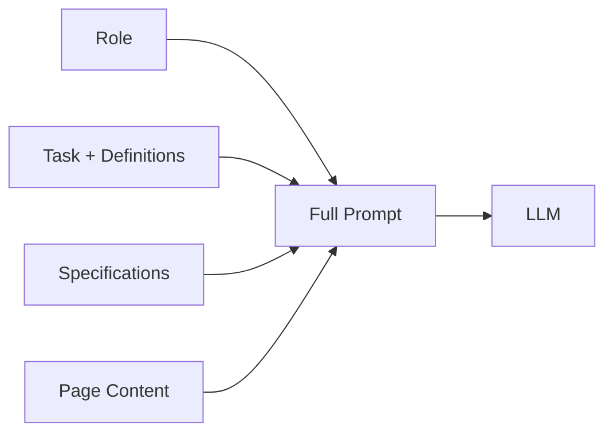
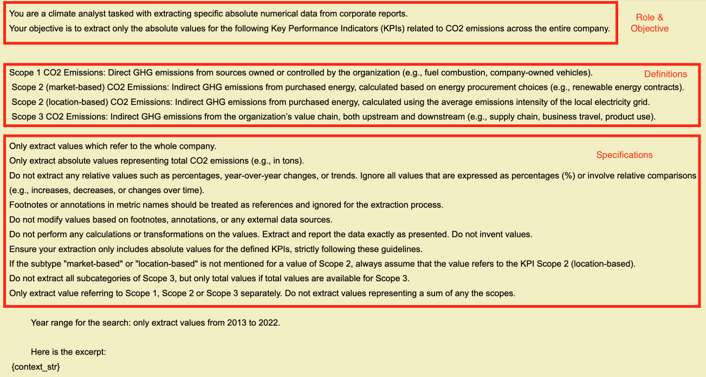

# Prompts

climatextract uses carefully designed prompts to instruct the LLM on extracting emissions data. This page explains the prompt design.

---

## Prompt Types

climatextract supports two prompt types:

### Question Prompt

Q&A format with regex-based parsing.

Pros & Cons: Higher recall, higher cost.  One slot per scope-year combination, which prevents same-page duplicates.

```toml
[extraction]
prompt_type = "default"
```

### Structured Prompt

Compact JSON output with Pydantic-based structured output parsing. 

Pros & Cons: ~75% cost reduction compared to `default` due to compact output (only found values are returned). Higher precision but lower recall, resulting in a lower F1 score compared to `default`. Can extract multiple values per scope-year from the same page, which increases duplicates.

```toml
[extraction]
prompt_type = "custom_gaia"
```

---

## Question Prompt (``default``)



The question prompt template consists of a
question for every scope-year combination in the respective year range 2013-2023 for every scope type Scope
1, 2 (market-based), 2 (location-based) and 3. The text in the red box had to be added to run our pipeline with
gpt5.2.

The question prompt uses a structured Q&A format where each scope-year combination is a separate question. Responses are parsed using regex-based extraction.

## Structured Prompt (``custom_gaia``)

The prompt consists of three parts:

1. **Role** – Defines the LLM's persona
2. **Task** – Specifies what to extract
3. **Specifications** – Rules and constraints





The structured prompt template consists of
role and objective, definitions of scope types, extraction
rules and desired year range.


---

### Role Definition

The LLM is instructed to act as a climate analyst:

> "You are a climate analyst tasked with extracting specific absolute numerical data from corporate reports. Your objective is to extract only the absolute values for the following Key Performance Indicators (KPIs) related to CO2 emissions across the entire company."

---

### KPI Definitions

The prompt provides clear definitions for each scope:

| Scope | Definition |
|-------|------------|
| **Scope 1** | Direct GHG emissions from sources owned or controlled by the organization |
| **Scope 2** | Indirect GHG emissions from purchased electricity, steam, heating, and cooling |
| **Scope 3** | Indirect GHG emissions from the organization's value chain (upstream and downstream) |

---

### Extraction Specifications

The prompt includes rules to ensure data quality:

- Only extract values for the **whole company** (not divisions/subsidiaries)
- Exclude percentage changes or relative values
- Exclude targets or forecasts
- Extract **separate** Scope 1, 2, 3 values (not combined totals)
- Return `null` if data is not available

---

### Output Format

**`custom_gaia`** instructs the LLM to return JSON matching this schema:

```json
{
  "KPI_Entries": [
    {
      "year": 2023,
      "scope": "1",
      "value": 55000.0,
      "unit": "tCO2e"
    }
  ]
}
```

This is validated using Pydantic models to ensure data quality.

---

## Next Steps

- [Evaluation](evaluation.md) – Measuring extraction quality
- [API Reference](../api-reference/public-api.md) – Public API functions
