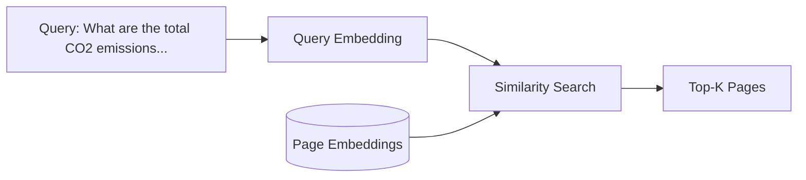
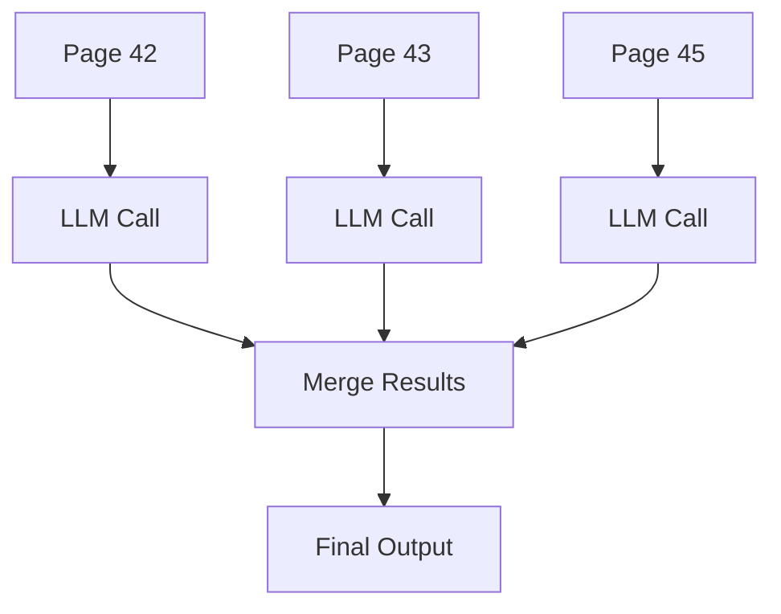

# RAG Pipeline

climatextract implements a Retrieval-Augmented Generation (RAG) pipeline specifically designed for extracting structured data from sustainability reports. This page explains the retrieval and generation stages in detail.

---

## What is RAG?

RAG combines two approaches:

1. **Retrieval** – Find relevant context from a large document corpus
2. **Generation** – Use an LLM to extract/generate answers from that context

This is more effective than prompting an LLM with entire documents because:

- LLMs have context window limits
- Irrelevant content can confuse the model
- Focused context improves extraction accuracy

---

## Retrieval Stage

### Embedding Documents

Each PDF page is converted to a vector embedding:

```python
# Simplified view of the embedding process
for page in pdf_pages:
    text = extract_text(page)
    embedding = embed_model.encode(text)
    store_in_database(page_id, embedding)
```

The embeddings capture semantic meaning, allowing similar content to have similar vectors.

### Semantic Search

When processing a report, the pipeline:

1. Embeds a search query optimized for emissions data
2. Computes cosine similarity against page embeddings
3. Applies filtering to select the most relevant pages



### Search Configuration

Control retrieval behavior in `climatextract.toml`:

```toml
[extraction]
percentile_threshold = 95 # Score cutoff percentile. Keep 5% most similar pages and discard 95%
similarity_top_k = 7      # Maximum pages to retrieve, overrides percentile_threshold for long documents
similarity_min_k = 4      # Minimum pages to retrieve, overrides percentile_threshold for short documents

# Context window for semantic search (default: 0, meaning that no adjacent pages are used)
context_window = 0
```

---

## Generation Stage

### Page-by-Page Extraction

Each relevant page is processed independently:



This approach:

- Handles multi-page reports effectively
- Allows parallel processing for speed
- Provides page-level traceability

### Structured Output

The LLM is prompted to return data in a specific format:

```json
{
  "KPI_Entries": [
    {"year": 2023, "scope": "1", "value": 55000.0, "unit": "tCO2e"},
    {"year": 2023, "scope": "2", "value": 120000.0, "unit": "tCO2e"}
  ]
}
```

Pydantic models validate the output structure.

---

## Vector Database

climatextract uses **DuckDB** for embedding storage:

- File-based (no server required)
- Efficient similarity search with vector extensions
- Persists embeddings across runs (avoids re-embedding)

The database stores:

- PDF file metadata
- Page text and embeddings
- Search query embeddings (cached)

---

## Performance Considerations

!!! tip "Caching"
    Pre-embed your PDF corpus once. Subsequent runs will reuse cached embeddings, significantly reducing API costs and processing time.

!!! note "Parallel Processing"
    LLM calls are made concurrently. Adjust `max_parallel_llm_prompts_running` based on your API rate limits.
